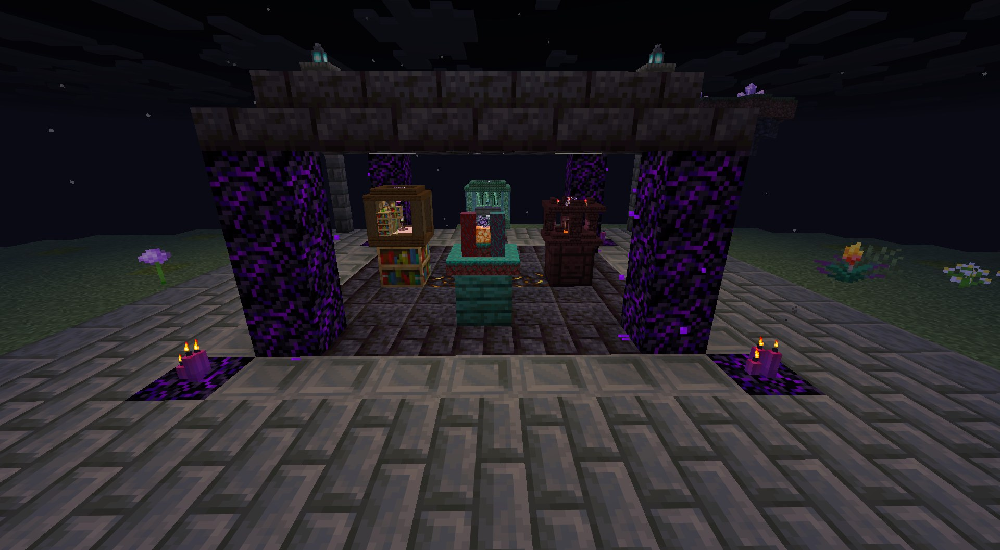
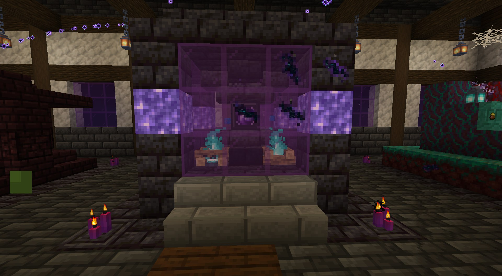
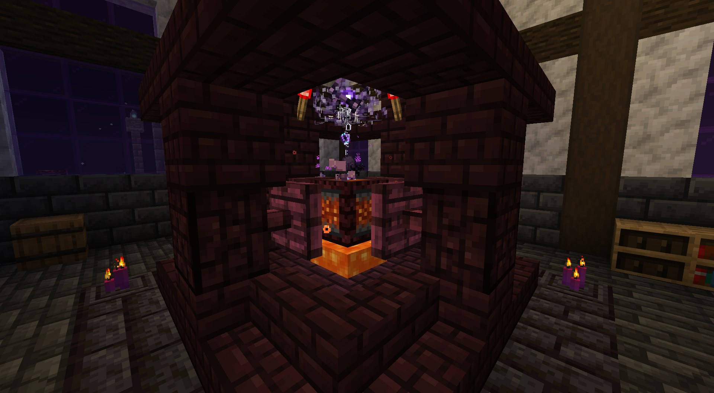
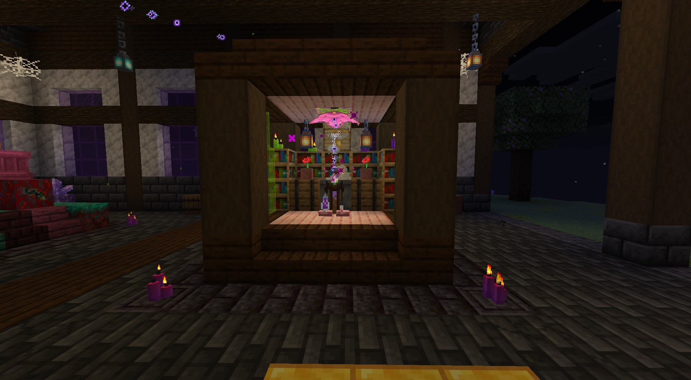
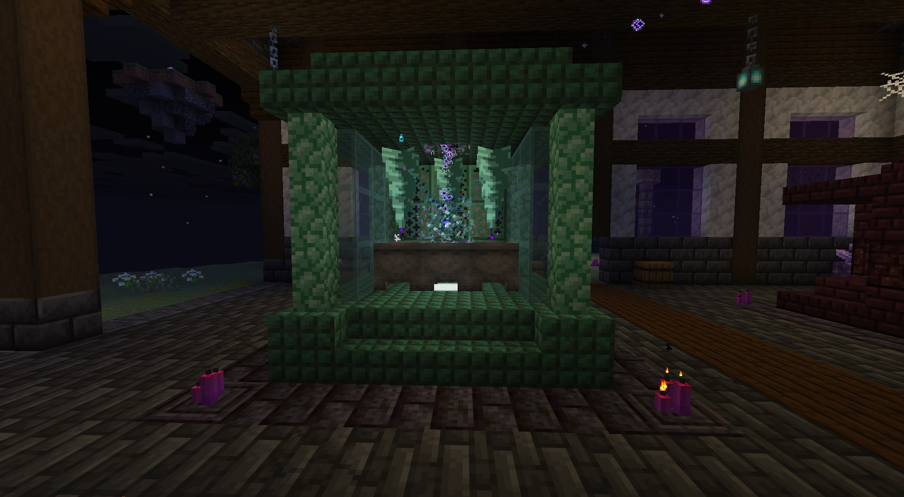
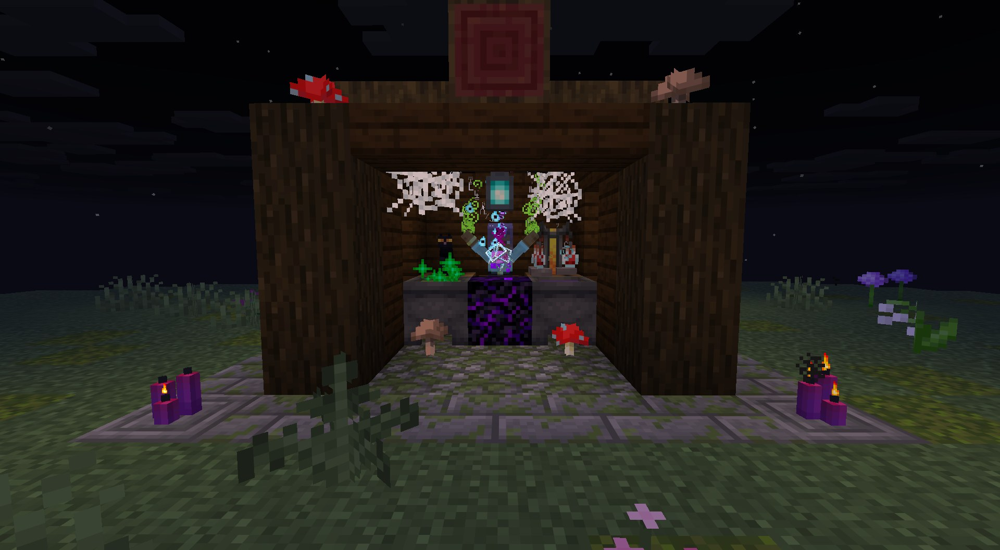
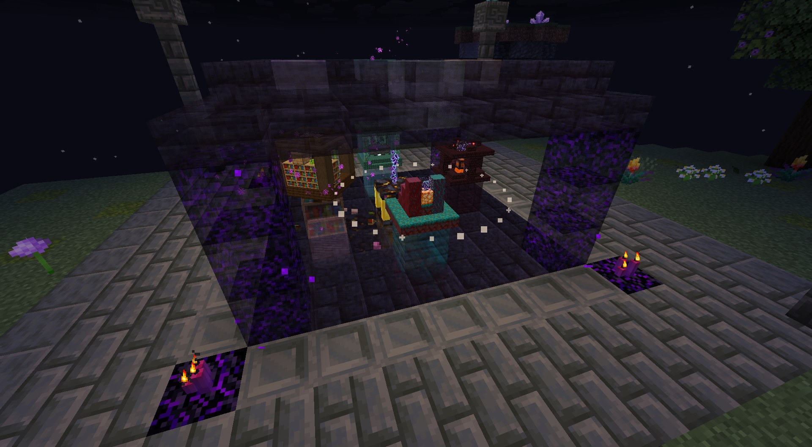
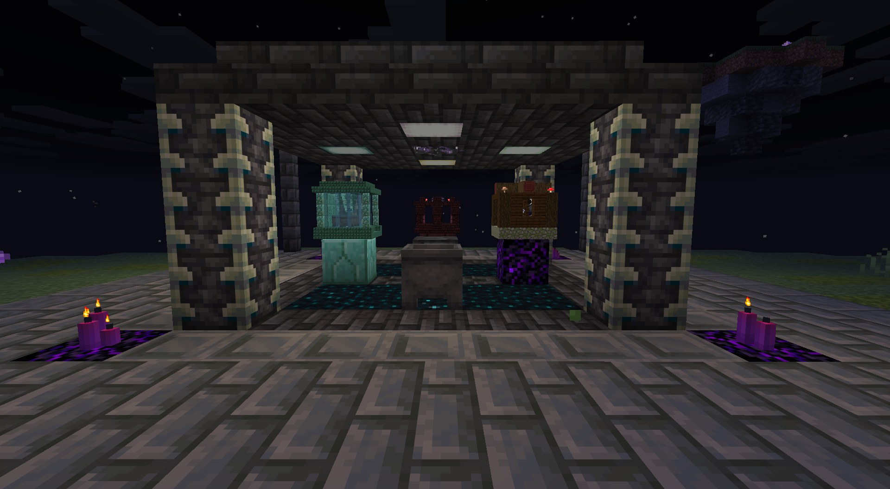

# AlchyMastery

An alchemy mod for NeoForge (Minecraft 26.1.2). Tear reality open, hold the distortion in a chamber, and use it to run the alchemical cycle: break matter down into compounds, transmute them, and rebuild them into ores and ingots.



- **Distortion Chamber**: burns lapis into distortion energy (DE)
- **Wormholes**: carry the energy to machines up to 124 blocks away
- **Machines**: Destructuration, Transmutation, Condensator, Reconstruction and the Rendering Cauldron (mob essences into liquid experience)
- **Upgrades**: Speed, Productivity, Efficiency and Parallel, with visible corruption as you push the machines
- **Nexuses**: whole chambers folded into one machine
- **The Alchemist's Codex**: an in-game journal (Patchouli) with an animated void theme, unlocking chapter by chapter

## Screenshots

| | |
|---|---|
|  **Distortion Chamber**: lapis burns behind the glass, rifts already tearing through the panes |  **Destructuration Chamber**: pistons crush matter over a lava pool into pure compounds |
|  **Transmutation Chamber**: a book that reads itself. Show it what you want, and matter listens |  **Distortion Condensator**: under dripstone, water thickens into distortion fluid |
|  **Rendering Cauldron**: a soul tends the crystal, rendering mob essences into liquid experience |  **A Nexus forming**: the chambers phase out and come back through rifts, folded into miniatures |
|  **Experience Nexus**: mob drops in, liquid experience out | |

## Requirements

- NeoForge 26.1.2
- [AlchyX](https://github.com/JustAlex14/AlchyX)
- Optional: Patchouli (the Codex), JEI (recipes), Jade

## Building

Build and publish AlchyX to your local Maven first (`./gradlew publishToMavenLocal` in AlchyX), then:

```
./gradlew build
```

The jar ends up in `build/libs`.

## License

MIT, see [LICENSE](LICENSE).

A few textures are recolored from Minecraft and Patchouli textures; those stay under their original owners' terms.
